# HexSynergy - Technical Architecture & Functional Architecture Diagrams

---

**Document Version:** 1.0  
**Date:** May 24, 2025  
**Prepared By:** EcoFuelers Development Team  
**Project:** HexSynergy - Renewable Energy Consumption Dashboard  

---

## Table of Contents

1. [System Overview](#1-system-overview)
2. [Technical Architecture Diagrams](#2-technical-architecture-diagrams)
3. [Functional Architecture Diagrams](#3-functional-architecture-diagrams)
4. [Component Interaction Diagrams](#4-component-interaction-diagrams)
5. [Data Flow Diagrams](#5-data-flow-diagrams)
6. [Deployment Architecture](#6-deployment-architecture)

---

## 1. System Overview

HexSynergy is built using a modern React-based frontend architecture with TypeScript, integrated with real-time data processing and gamification systems. The architecture follows component-based design patterns with clear separation of concerns.

### 1.1 Technology Stack (Based on Actual Codebase)

```
Frontend Framework: React 18.3.1 + TypeScript 5.5.3
Build Tool: Vite 5.4.1
UI Framework: Tailwind CSS + shadcn/ui
State Management: React Context API + TanStack Query
Visualization: Recharts + Three.js
Testing: Vitest + React Testing Library
```

---

## 2. Technical Architecture Diagrams

### 2.1 High-Level System Architecture

```mermaid
graph TB
    subgraph "Client Layer"
        WB[Web Browser]
        MB[Mobile Browser]
    end
    
    subgraph "Frontend Application (React + TypeScript)"
        subgraph "Core Application"
            APP[App.tsx<br/>Main Application Entry]
            RT[React Router<br/>Navigation & Routing]
            EB[ErrorBoundary<br/>Error Handling]
        end
        
        subgraph "Context Providers"
            AC[AuthContext<br/>Authentication State]
            DC[DataContext<br/>Real-time Data Management]
            QC[QueryClient<br/>Server State Caching]
        end
        
        subgraph "Page Components"
            IDX[Index.tsx<br/>Landing Page]
            DASH[Dashboard.tsx<br/>Energy Dashboard]
            LB[Leaderboard.tsx<br/>Gamification]
            ADM[Admin.tsx<br/>Administration]
            LOG[Login.tsx<br/>Authentication]
        end
        
        subgraph "Feature Components"
            EC[EnergyConsumptionCard<br/>Energy Tracking]
            SC[SustainabilityChart<br/>Data Visualization]
            FM[FloorMap<br/>Building Layout]
            APC[AwePointsCard<br/>Gamification]
            LN[LiveNotifications<br/>Real-time Alerts]
        end
        
        subgraph "UI Components (shadcn/ui)"
            BTN[Button, Card, Dialog]
            CHT[Charts, Progress, Tabs]
            FRM[Form, Input, Select]
        end
    end
    
    subgraph "Data Layer"
        subgraph "Static Data"
            MD[mockData.ts<br/>Employee & Building Data]
            SD[sustainabilityData.ts<br/>HexAware Metrics]
            CONST[constants.ts<br/>Unified Constants]
        end
        
        subgraph "Real-time Data Sources"
            BMS[Building Management<br/>Systems]
            IOT[IoT Sensors<br/>Proximity & Environment]
            DEV[Device APIs<br/>Laptop Monitoring]
        end
    end
    
    subgraph "External Services"
        AD[Active Directory<br/>Authentication]
        WS[Weather Services<br/>Environmental Data]
        ES[Energy Systems<br/>Grid Information]
    end
    
    WB --> APP
    MB --> APP
    APP --> RT
    APP --> EB
    RT --> IDX
    RT --> DASH
    RT --> LB
    RT --> ADM
    RT --> LOG
    
    AC --> DASH
    DC --> DASH
    QC --> DASH
    
    DASH --> EC
    DASH --> SC
    DASH --> FM
    DASH --> APC
    DASH --> LN
    
    EC --> BTN
    SC --> CHT
    FM --> BTN
    APC --> FRM
    
    DC --> MD
    DC --> SD
    DC --> CONST
    DC --> BMS
    DC --> IOT
    DC --> DEV
    
    AC --> AD
    DC --> WS
    DC --> ES
```

### 2.2 Frontend Component Architecture

```mermaid
graph TD
    subgraph "Application Root"
        APP[App.tsx]
        APP --> EB[ErrorBoundary]
        APP --> QCP[QueryClientProvider]
        APP --> BR[BrowserRouter]
        APP --> AP[AuthProvider]
        APP --> DP[DataProvider]
        APP --> TTP[TooltipProvider]
    end
    
    subgraph "Routing Layer"
        BR --> RT[Routes]
        RT --> R1[/ → Index]
        RT --> R2[/login → Login]
        RT --> R3[/dashboard → Dashboard]
        RT --> R4[/leaderboard → Leaderboard]
        RT --> R5[/admin → Admin]
        RT --> R6[/* → NotFound]
    end
    
    subgraph "Protected Routes"
        PR[ProtectedRoute]
        R3 --> PR
        R4 --> PR
        R5 --> PR
        PR --> DASH[Dashboard.tsx]
        PR --> LB[Leaderboard.tsx]
        PR --> ADM[Admin.tsx]
    end
    
    subgraph "Dashboard Components"
        DASH --> NB[NavBar]
        DASH --> DF[DashboardFilters]
        DASH --> TABS[Tabs Component]
        
        TABS --> T1[Overview Tab]
        TABS --> T2[Buildings Tab]
        TABS --> T3[Departments Tab]
        TABS --> T4[Energy Tab]
        TABS --> T5[Carbon Tab]
        TABS --> T6[Elevator Tab]
        TABS --> T7[Lighting Tab]
        
        T1 --> ECC[EnergyConsumptionCard]
        T1 --> SC[SustainabilityChart]
        T1 --> APC[AwePointsCard]
        T1 --> FM[FloorMap]
        T1 --> DC[DashboardCard]
        
        T2 --> BOC[BuildingOverviewCard]
        T3 --> DCC[DepartmentComparisonCard]
        T4 --> EUC[ElevatorUsageCard]
        T5 --> SLC[SmartLightingCard]
    end
    
    subgraph "Leaderboard Components"
        LB --> LH[LeaderboardHeader]
        LB --> LF[LeaderboardFilters]
        LB --> LL[LeaderboardList]
        LB --> TTP[TopThreePodium]
        LB --> DR[DepartmentRankings]
        LB --> UPC[UserProgressCard]
    end
    
    subgraph "Shared Components"
        EIC[EcoImpactCounter]
        ESG[EnergySavingGlobe]
        LMP[LiveMetricsPanel]
        LN[LiveNotifications]
        EC[EmployeeCard]
    end
```

### 2.3 Data Management Architecture

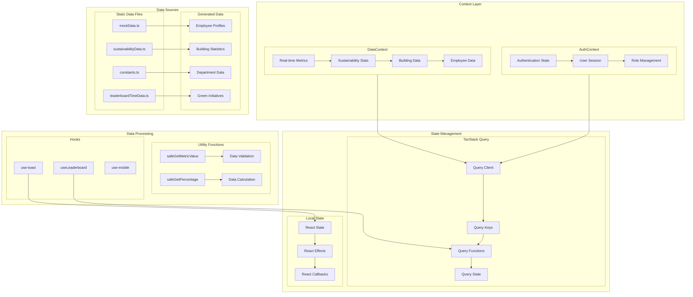

---

## 3. Functional Architecture Diagrams

### 3.1 Energy Monitoring System

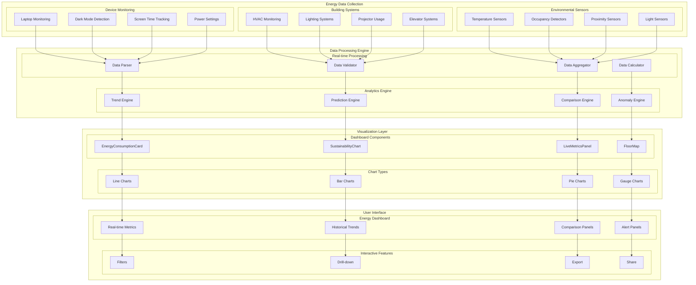

### 3.2 Gamification System Architecture

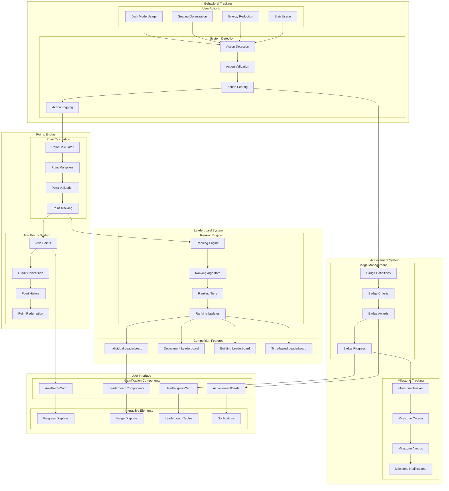

### 3.3 Smart Building Integration

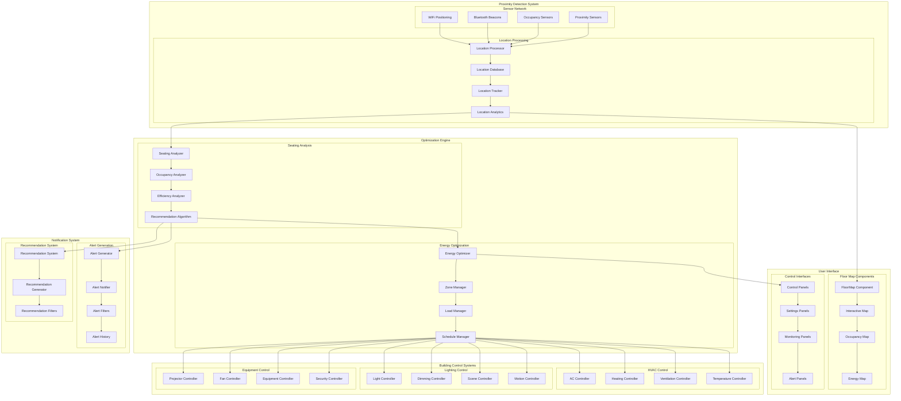

---

## 4. Component Interaction Diagrams

### 4.1 Dashboard Component Interactions

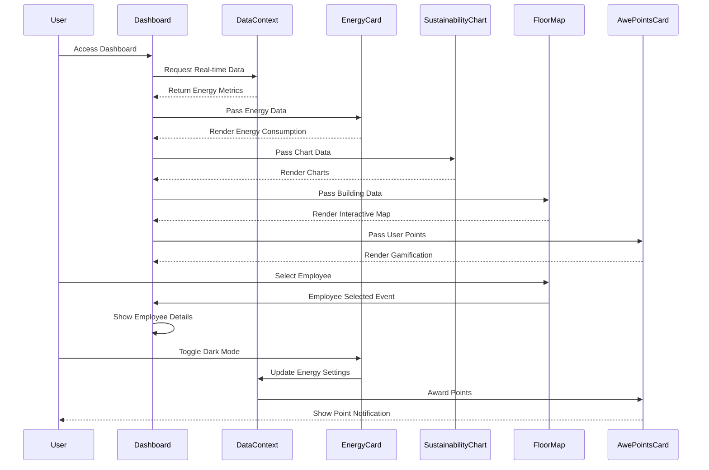

### 4.2 Gamification Flow

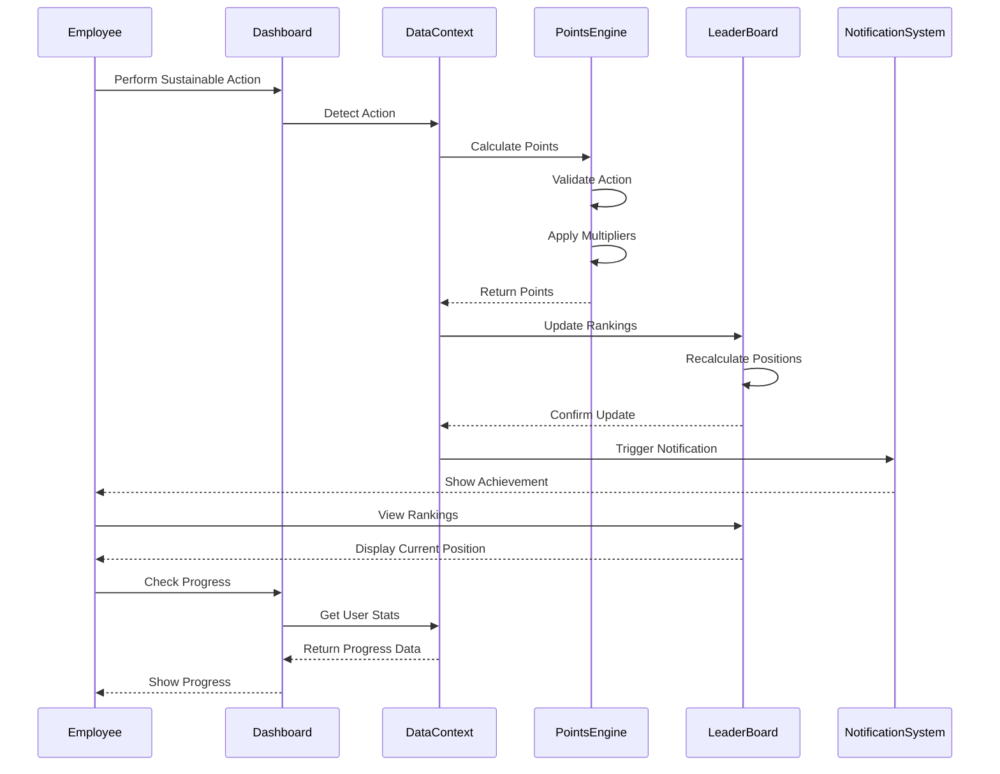

### 4.3 Building Automation Flow

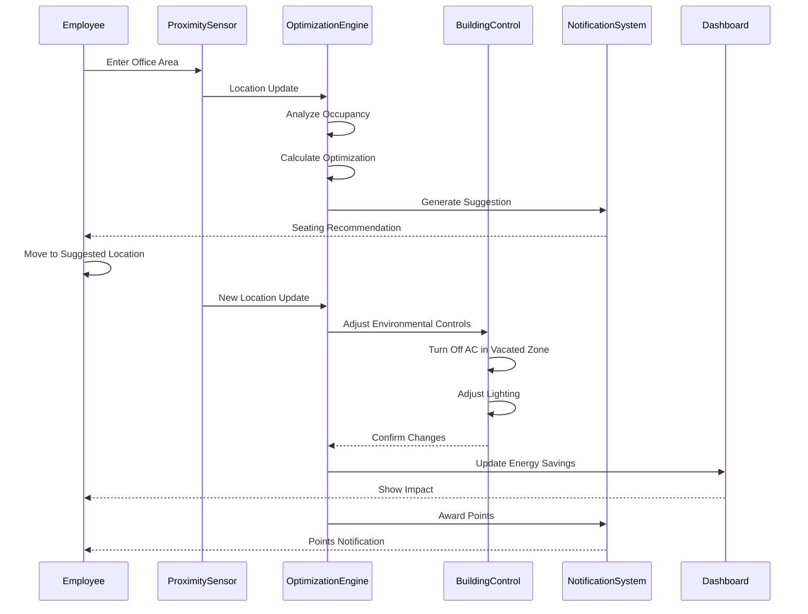

---

## 5. Data Flow Diagrams

### 5.1 Real-time Data Flow

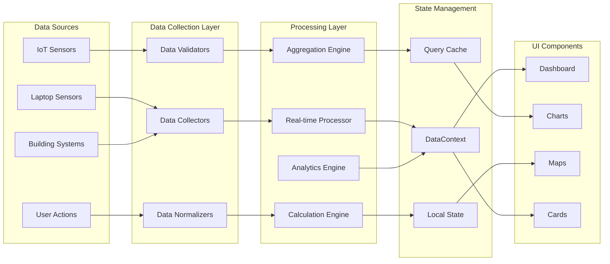

### 5.2 User Interaction Data Flow

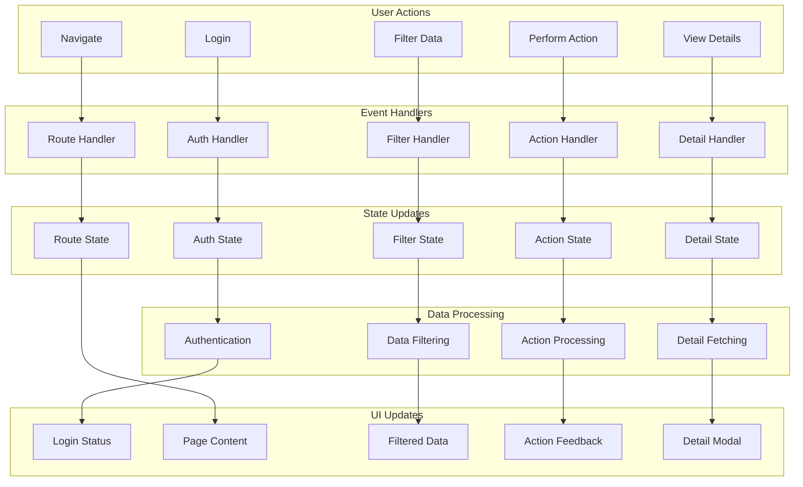

---

## 6. Deployment Architecture

### 6.1 Development Environment

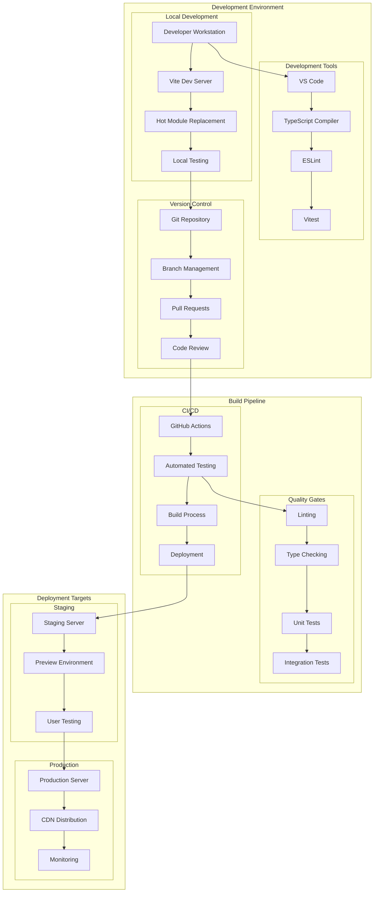

### 6.2 Production Architecture

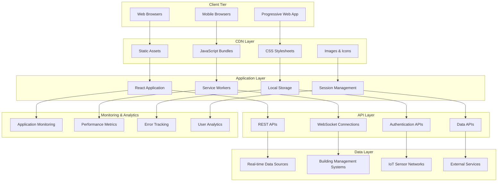

---

## 7. Component Dependency Graph

### 7.1 Core Dependencies

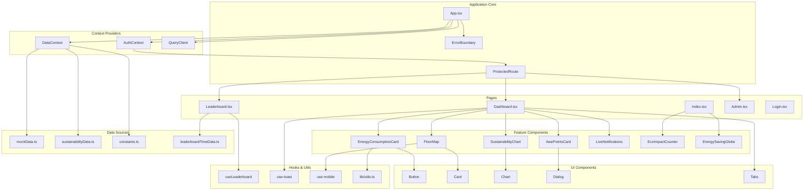

### 7.2 Testing Dependencies

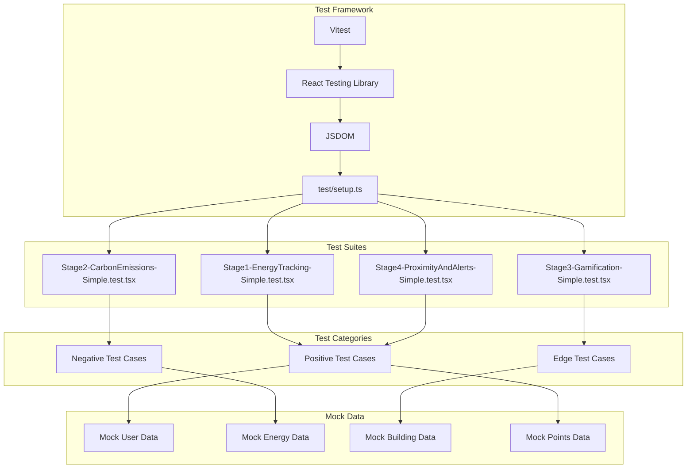

---

## 8. Security Architecture

### 8.1 Authentication & Authorization Flow

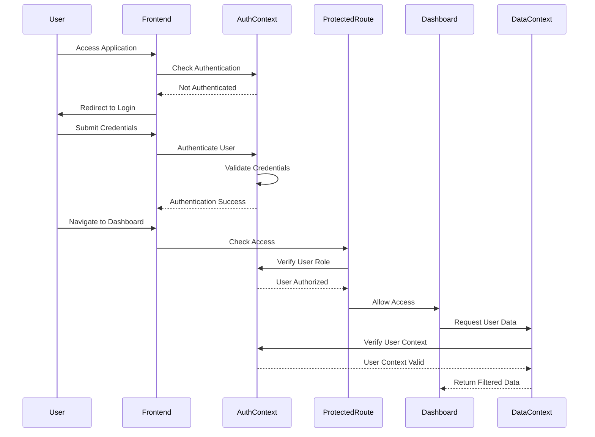

### 8.2 Data Privacy & Security

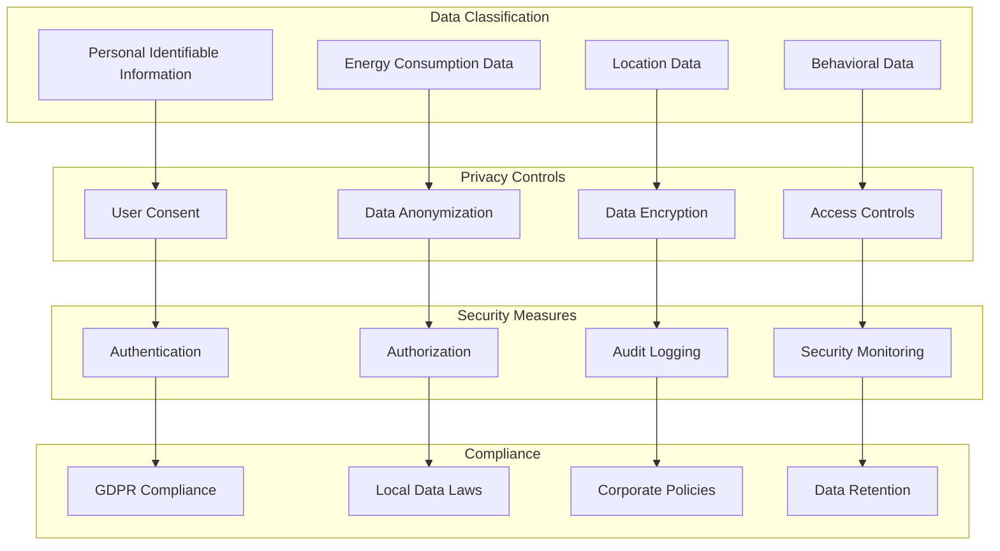

---

## 9. Performance Architecture

### 9.1 Frontend Performance Optimization

```mermaid
graph TD
    subgraph "Code Splitting"
        LAZY[Lazy Loading]
        DYNAMIC[Dynamic Imports]
        CHUNKS[Code Chunks]
        PRELOAD[Preloading]
    end
    
    subgraph "State Management"
        CONTEXT[React Context]
        QUERY[TanStack Query]
        CACHE[Query Caching]
        STALE[Stale While Revalidate]
    end
    
    subgraph "Rendering Optimization"
        MEMO[React.memo]
        CALLBACK[useCallback]
        EFFECT[useEffect]
        VIRTUAL[Virtual Scrolling]
    end
    
    subgraph "Asset Optimization"
        BUNDLE[Bundle Splitting]
        COMPRESS[Compression]
        CDN[CDN Distribution]
        CACHE_STATIC[Static Caching]
    end
    
    LAZY --> DYNAMIC
    DYNAMIC --> CHUNKS
    CHUNKS --> PRELOAD
    
    CONTEXT --> QUERY
    QUERY --> CACHE
    CACHE --> STALE
    
    MEMO --> CALLBACK
    CALLBACK --> EFFECT
    EFFECT --> VIRTUAL
    
    BUNDLE --> COMPRESS
    COMPRESS --> CDN
    CDN --> CACHE_STATIC
```

### 9.2 Real-time Data Performance

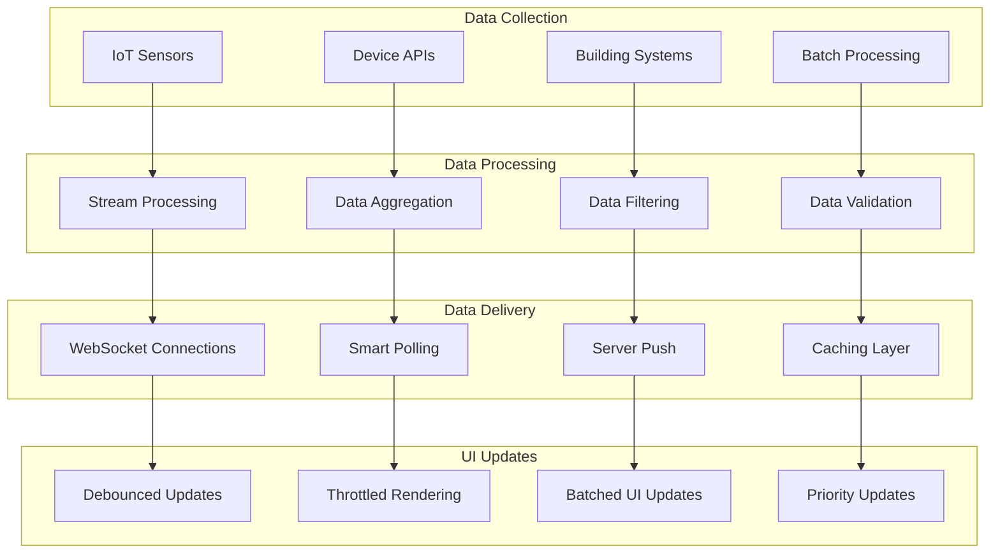

---

## 10. Integration Architecture

### 10.1 External System Integration

```mermaid
graph TB
    subgraph "HexSynergy Frontend"
        REACT[React Application]
        CONTEXT[Data Context]
        API[API Layer]
    end
    
    subgraph "Building Management Systems"
        HVAC_SYS[HVAC Systems]
        LIGHTING_SYS[Lighting Control]
        SECURITY_SYS[Security Systems]
        ENERGY_SYS[Energy Meters]
    end
    
    subgraph "IoT Infrastructure"
        PROXIMITY[Proximity Sensors]
        OCCUPANCY[Occupancy Sensors]
        ENVIRONMENT[Environmental Sensors]
        BEACONS[Bluetooth Beacons]
    end
    
    subgraph "Enterprise Systems"
        AD[Active Directory]
        HR_SYS[HR Systems]
        FACILITY[Facility Management]
        REPORTING[Reporting Systems]
    end
    
    subgraph "External Services"
        WEATHER[Weather APIs]
        ENERGY_GRID[Energy Grid Data]
        CARBON[Carbon Footprint APIs]
        MAPS[Mapping Services]
    end
    
    REACT --> CONTEXT
    CONTEXT --> API
    
    API --> HVAC_SYS
    API --> LIGHTING_SYS
    API --> SECURITY_SYS
    API --> ENERGY_SYS
    
    API --> PROXIMITY
    API --> OCCUPANCY
    API --> ENVIRONMENT
    API --> BEACONS
    
    API --> AD
    API --> HR_SYS
    API --> FACILITY
    API --> REPORTING
    
    API --> WEATHER
    API --> ENERGY_GRID
    API --> CARBON
    API --> MAPS
```

### 10.2 Data Integration Flow

```mermaid
sequenceDiagram
    participant Frontend
    participant DataContext
    participant APIGateway
    participant BuildingSystem
    participant IoTSensors
    participant ExternalAPI
    
    Frontend->>DataContext: Request Real-time Data
    DataContext->>APIGateway: Fetch Building Data
    
    APIGateway->>BuildingSystem: Get HVAC Status
    BuildingSystem-->>APIGateway: Return HVAC Data
    
    APIGateway->>IoTSensors: Get Sensor Readings
    IoTSensors-->>APIGateway: Return Sensor Data
    
    APIGateway->>ExternalAPI: Get Weather Data
    ExternalAPI-->>APIGateway: Return Weather Info
    
    APIGateway-->>DataContext: Aggregated Data
    DataContext->>DataContext: Process & Validate
    DataContext-->>Frontend: Real-time Metrics
    
    Frontend->>Frontend: Update UI Components
```

---

## 11. Monitoring & Observability

### 11.1 Application Monitoring

```mermaid
graph TD
    subgraph "Frontend Monitoring"
        PERF[Performance Metrics]
        ERROR[Error Tracking]
        USER[User Analytics]
        VITALS[Core Web Vitals]
    end
    
    subgraph "Real-time Monitoring"
        METRICS[Live Metrics]
        ALERTS[Alert System]
        HEALTH[Health Checks]
        UPTIME[Uptime Monitoring]
    end
    
    subgraph "Data Quality Monitoring"
        ACCURACY[Data Accuracy]
        COMPLETENESS[Data Completeness]
        LATENCY[Data Latency]
        ANOMALY[Anomaly Detection]
    end
    
    subgraph "Business Monitoring"
        ENGAGEMENT[User Engagement]
        ADOPTION[Feature Adoption]
        SUSTAINABILITY[Sustainability KPIs]
        ROI[ROI Metrics]
    end
    
    PERF --> METRICS
    ERROR --> ALERTS
    USER --> HEALTH
    VITALS --> UPTIME
    
    METRICS --> ACCURACY
    ALERTS --> COMPLETENESS
    HEALTH --> LATENCY
    UPTIME --> ANOMALY
    
    ACCURACY --> ENGAGEMENT
    COMPLETENESS --> ADOPTION
    LATENCY --> SUSTAINABILITY
    ANOMALY --> ROI
```

### 11.2 Logging Architecture

```mermaid
graph LR
    subgraph "Log Sources"
        FRONTEND[Frontend Logs]
        API[API Logs]
        SYSTEM[System Logs]
        SECURITY[Security Logs]
    end
    
    subgraph "Log Processing"
        COLLECT[Log Collection]
        PARSE[Log Parsing]
        ENRICH[Log Enrichment]
        FILTER[Log Filtering]
    end
    
    subgraph "Log Storage"
        STRUCTURED[Structured Logs]
        SEARCH[Searchable Index]
        ARCHIVE[Log Archive]
        RETENTION[Retention Policy]
    end
    
    subgraph "Log Analysis"
        DASHBOARD[Log Dashboard]
        ALERTS_LOG[Log Alerts]
        ANALYTICS[Log Analytics]
        REPORTS[Log Reports]
    end
    
    FRONTEND --> COLLECT
    API --> PARSE
    SYSTEM --> ENRICH
    SECURITY --> FILTER
    
    COLLECT --> STRUCTURED
    PARSE --> SEARCH
    ENRICH --> ARCHIVE
    FILTER --> RETENTION
    
    STRUCTURED --> DASHBOARD
    SEARCH --> ALERTS_LOG
    ARCHIVE --> ANALYTICS
    RETENTION --> REPORTS
```

---

## 12. Scalability Architecture

### 12.1 Horizontal Scaling Strategy

```mermaid
graph TB
    subgraph "Load Distribution"
        LB[Load Balancer]
        CDN[Content Delivery Network]
        CACHE[Distributed Cache]
        SESSION[Session Store]
    end
    
    subgraph "Application Scaling"
        APP1[App Instance 1]
        APP2[App Instance 2]
        APP3[App Instance N]
        AUTO[Auto Scaling]
    end
    
    subgraph "Data Scaling"
        READ[Read Replicas]
        SHARD[Data Sharding]
        PARTITION[Data Partitioning]
        ARCHIVE[Data Archiving]
    end
    
    subgraph "Service Scaling"
        MICRO[Microservices]
        QUEUE[Message Queues]
        WORKER[Background Workers]
        ASYNC[Async Processing]
    end
    
    LB --> APP1
    LB --> APP2
    LB --> APP3
    CDN --> CACHE
    CACHE --> SESSION
    
    AUTO --> APP1
    AUTO --> APP2
    AUTO --> APP3
    
    APP1 --> READ
    APP2 --> SHARD
    APP3 --> PARTITION
    READ --> ARCHIVE
    
    MICRO --> QUEUE
    QUEUE --> WORKER
    WORKER --> ASYNC
```

---

**Document Summary**

This Technical Architecture and Functional Architecture document provides comprehensive diagrams covering:

1. **System Overview** - Technology stack and architectural principles
2. **Technical Architecture** - High-level system, component, and data management architectures
3. **Functional Architecture** - Energy monitoring, gamification, and smart building systems
4. **Component Interactions** - Sequence diagrams showing system flows
5. **Data Flow** - Real-time data processing and user interaction flows
6. **Deployment** - Development and production deployment architectures
7. **Security** - Authentication, authorization, and data privacy
8. **Performance** - Optimization strategies and real-time data handling
9. **Integration** - External system connections and data flows
10. **Monitoring** - Observability and logging strategies
11. **Scalability** - Horizontal scaling and growth strategies

All diagrams are based on the actual HexSynergy codebase structure and reflect the real implementation using React 18.3.1, TypeScript, Vite, shadcn/ui, and the specific components found in the project.

---

**© 2025 Hexaware Technologies - HexSynergy Project**  
**Prepared by EcoFuelers Development Team**  
**"Code for a Greener Future"**
